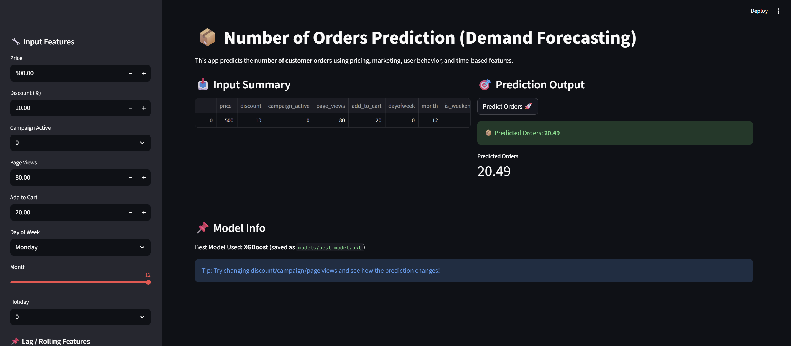

# 📦 Number of Orders Prediction (Demand Forecasting)

## 📌 Objective
Built a Machine Learning model to predict the number of customer orders for a product/service using historical order data.  
This helps businesses forecast demand, optimize inventory, and improve planning.

---

## 🧰 Tech Stack
- Python
- Pandas, NumPy
- Matplotlib, Seaborn
- Scikit-learn
- XGBoost
- Joblib
- Streamlit

---

## 📂 Dataset
Simulated historical e-commerce dataset with:
- Date/time
- Product ID
- Price and Discount
- Marketing campaign status
- User behavior (page views, add to cart)
- Target: `orders`

---

## ✅ Key Work Done
- Cleaned and preprocessed raw order data by handling missing values, encoding categorical variables, and normalizing numerical features.
- Performed Exploratory Data Analysis (EDA) to uncover trends, seasonality, and key predictors of order volume.
- Engineered features such as day-of-week, holiday flags, moving averages, and lag variables.
- Trained multiple regression models (Linear Regression, Random Forest, XGBoost) to predict the number of orders.
- Evaluated models using RMSE, MAE, and R² and selected the best-performing model.
- Visualized predictions using Actual vs Predicted plots and feature importance analysis.
- Deployed the final model for real-time prediction using a CLI inference script and a Streamlit web app.

---

## 📊 Model Performance
| Model | RMSE | MAE | R² |
|------|------|-----|----|
| Linear Regression | 2.3276 | 1.8296 | 0.8333 |
| Random Forest | 2.3760 | 1.8242 | 0.8263 |
| **XGBoost (Best)** | **2.3097** | **1.7613** | **0.8358** |

Best Model: **XGBoost**  
Saved Model: `models/best_model.pkl`

---

## 🚀 Web App Preview


---

## 📁 Project Structure
```
Number-of-Orders-Prediction/
│── assets/
│   ├── streamlit_app.png
│── data/
│   ├── orders_raw.csv
│   ├── final_orders_features.csv
│── models/
│   ├── best_model.pkl
│── src/
│   ├── eda.py
│   ├── feature_engineering.py
│   ├── train_models.py
│   ├── visualize_results.py
│   ├── predict.py
│── app.py
│── requirements.txt
│── README.md
```

---

## ▶️ How to Run

### 1️⃣ Install dependencies
```bash
pip install -r requirements.txt
```

### 2️⃣ Run EDA
```bash
python src/eda.py
```

### 3️⃣ Feature Engineering
```bash
python src/feature_engineering.py
```

### 4️⃣ Train Models
```bash
python src/train_models.py
```

### 5️⃣ Visualize Results
```bash
python src/visualize_results.py
```

### 6️⃣ Predict Orders (CLI Deployment)
```bash
python src/predict.py
```

Example Output:
```txt
📦 Predicted Orders: 23.45
```

---

## 🌐 Streamlit Web App (Deployment)
Run the web app locally:
```bash
streamlit run app.py
```

---

## 📌 Key Insights
- Orders show weekly seasonality with higher demand on weekends.
- Marketing campaigns significantly increase order volume.
- User behavior signals (page views and add-to-cart) are the strongest predictors of demand.

---

## 👨‍💻 Author
**Dev Pandey**  
Role: Software Engineer  

---

## 📝 License
This project is open-source and available for educational purposes.
